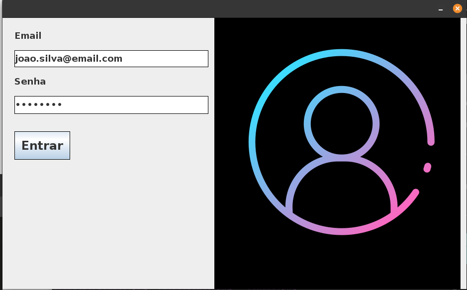
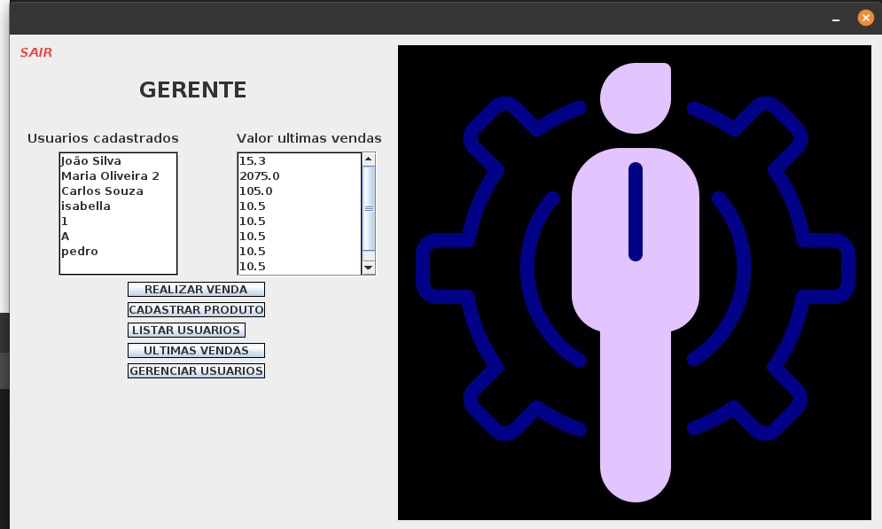
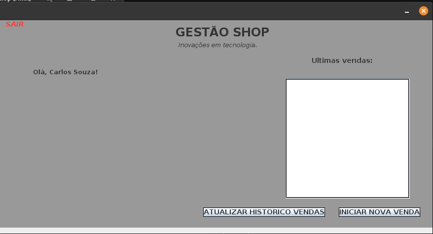
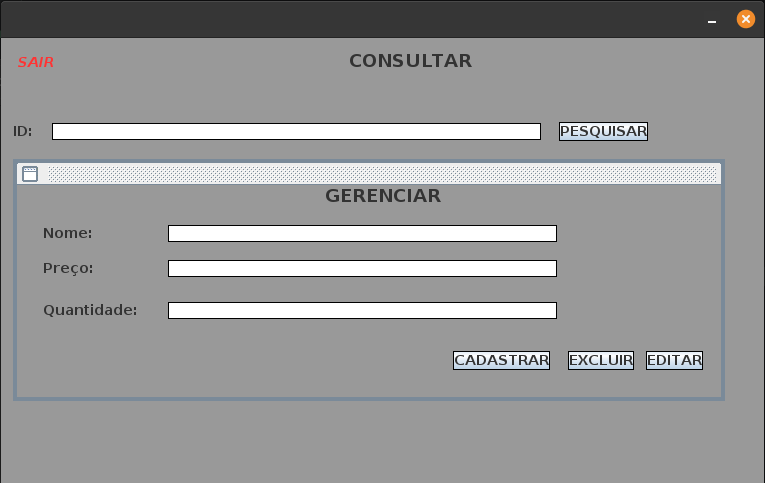
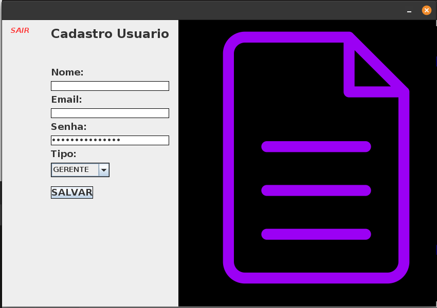
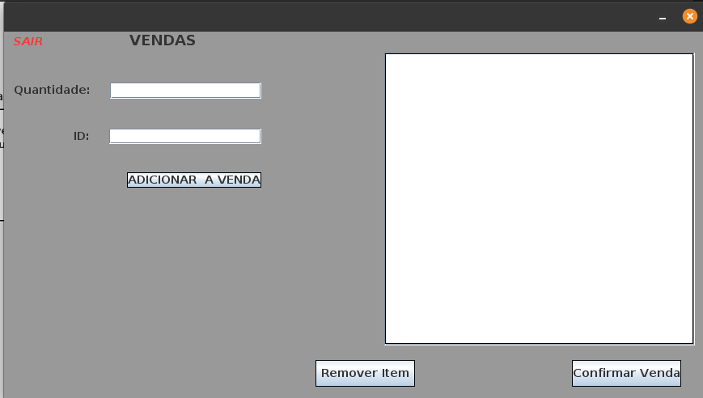

# 🛒 Gestão Shop

Sistema desktop de gestão de loja desenvolvido em **Java + Swing** com banco de dados **MySQL**.

---

## 📸 Screenshots

### Login


### Tela Principal — Gerente


### Tela Principal — Vendedor


### Cadastro de Produto


### Cadastro de Usuário


### Vendas


---

## ✨ Funcionalidades

- 🔐 Autenticação de usuários com perfis (Gerente / Vendedor)
- 📦 Cadastro e consulta de produtos
- 👤 Cadastro de usuários
- 🛍️ Registro de vendas
- 🖥️ Interface gráfica com Java Swing

---

## 🏗️ Arquitetura

O sistema foi desenvolvido utilizando **Java Swing** para interface gráfica e **MySQL** para persistência de dados, com conexão via **JDBC**.

As funcionalidades incluem:
- Autenticação de usuários com controle de perfil
- CRUD de produtos
- CRUD de usuários
- Registro de vendas
- Consultas ao banco de dados via JDBC

---

## 🛠️ Tecnologias

| Tecnologia | Versão |
|---|---|
| Java | 11+ |
| Swing | (nativo JDK) |
| MySQL | 8.0+ |
| Maven | 3.8+ |
| mysql-connector-java | 8.0.33 |

---

## 🚀 Como rodar

### 1. Pré-requisitos

- Java 11 ou superior instalado
- MySQL 8 rodando localmente
- Maven instalado

### 2. Clone o repositório

```bash
git clone https://github.com/CauaPeresAdriani/gestao-shop.git
cd gestao-shop
```

### 3. Configure o banco de dados

```bash
mysql -u root -p -e "CREATE DATABASE gestao_shop;"
mysql -u root -p gestao_shop < gestao_shop.sql
```

### 4. Configure a conexão

Edite `src/gestao_shop/ConexaoMySQL.java` com suas credenciais, ou use variáveis de ambiente:

```bash
export DB_HOST=localhost
export DB_PORT=3306
export DB_NAME=gestao_shop
export DB_USER=root
export DB_PASSWORD=suasenha
```

### 5. Compile e execute

```bash
mvn clean package
java -jar target/gestao-shop.jar
```

---

## 📁 Estrutura do projeto

```
gestao-shop/
├── src/
│   └── gestao_shop/
│       ├── Gestao_Shop.java                # Ponto de entrada
│       ├── ConexaoMySQL.java               # Conexão com banco (não versionado)
│       ├── Banco_Main.java
│       ├── Produto.java / Usuario.java / Venda.java / TipoUsuario.java
│       ├── Tela_venda.java / .form
│       ├── TelaLogin.java / .form
│       ├── TelaPrincipalGerente.java / .form
│       ├── TelaPrincipalVendedor.java / .form
│       ├── TelaCadastroUsuario.java / .form
│       └── Consultar_Produto.java / .form
├── docs/                                   # Screenshots
├── gestao_shop.sql                         # Script do banco
├── pom.xml                                 # Configuração Maven
└── .gitignore
```

---

## ⚙️ Instalando MySQL no Linux

```bash
sudo apt update
sudo apt install mysql-server -y
sudo systemctl start mysql
sudo systemctl enable mysql
sudo mysql_secure_installation
```

---

## 📝 Observações

Projeto desenvolvido para fins de estudo e aprendizado de Java Desktop.

Melhorias futuras planejadas:
- Criptografia de senhas
- Separação em camadas (DAO / Service)
- Melhor tratamento de exceções
- Testes automatizados
- Design
---

*Desenvolvido com ☕ Java*
